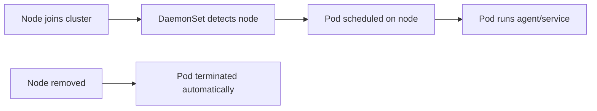
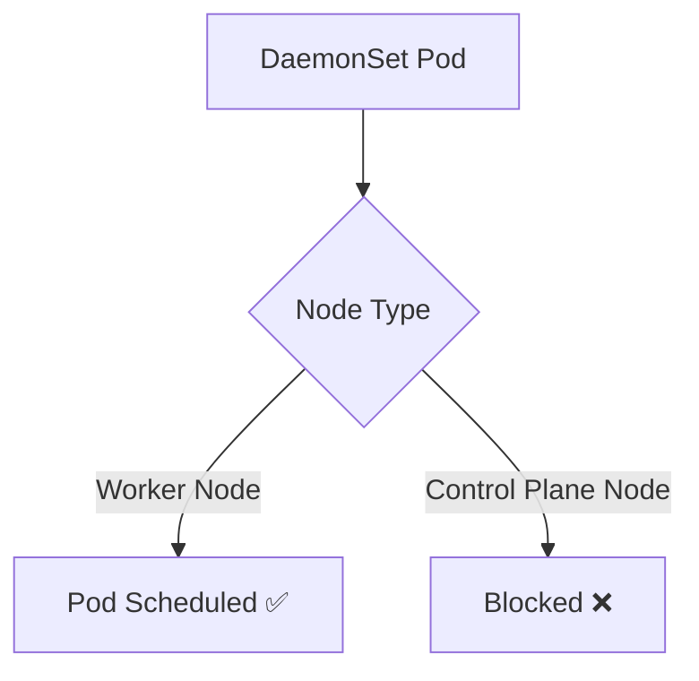
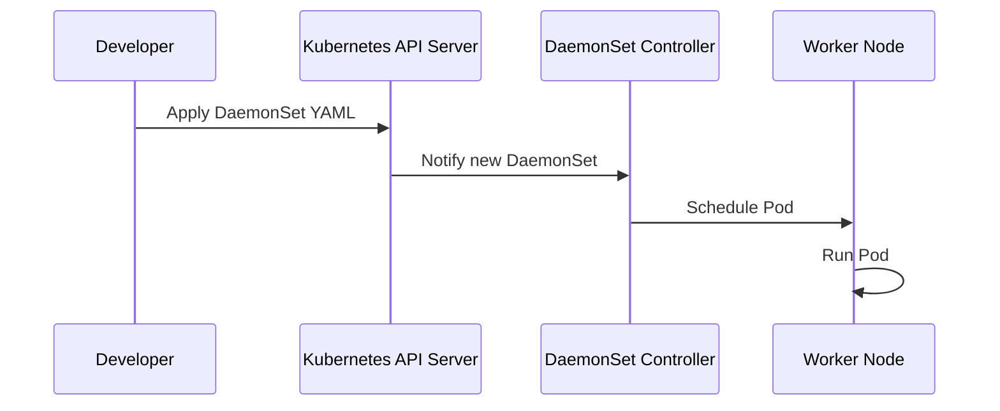
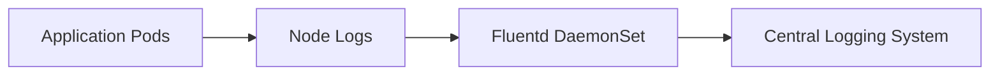

# Kubernetes DaemonSets – Complete Tutorial

## 📘 Introduction

In Kubernetes, workloads are typically deployed using controllers like Deployments or ReplicaSets. These controllers focus on **scaling applications horizontally** by running multiple replicas of a Pod across the cluster.

However, some use cases require a **different pattern** — running exactly **one Pod on every node** (or a subset of nodes). This is where **DaemonSets** come into play.

> **DaemonSet** ensures that a copy of a specific Pod runs on **all (or selected) nodes** in a Kubernetes cluster.

---

## 🧠 Why Do We Need DaemonSets?

Not all workloads are application-facing. Some workloads are **node-level services** that must exist on every node.

### Key Problem:

If you use a Deployment:

* Pods are distributed arbitrarily
* Some nodes may not have the required agent
* New nodes won’t automatically get the required Pod

### DaemonSet Solution:

* Guarantees **1 Pod per node**
* Automatically:

  * Adds Pods when new nodes join
  * Removes Pods when nodes leave

---

## ⚙️ DaemonSet vs ReplicaSet

| Feature    | ReplicaSet / Deployment | DaemonSet           |
| ---------- | ----------------------- | ------------------- |
| Pod Count  | Defined by `replicas`   | One per node        |
| Scheduling | Random distribution     | One Pod per node    |
| Scaling    | Manual / Auto scaling   | Automatic per node  |
| Use Case   | Application workloads   | Node-level services |

---

## 🏗️ How DaemonSets Work

A DaemonSet controller:

1. Watches for nodes in the cluster
2. Schedules exactly one Pod per node
3. Ensures consistency when nodes change

### 🔁 Lifecycle Behavior



---

## 🚫 Why Pods Don’t Run on Control Plane Nodes by Default

By default:

* Control plane nodes are **tainted**
* DaemonSets **don’t tolerate those taints**

### Default Behavior:



### To Allow Scheduling on Control Plane:

You must define **tolerations** in the DaemonSet spec.

---

## 🧩 Common Real-World Use Cases

DaemonSets are typically used for **infrastructure-level agents**:

### 🔍 Monitoring

* Node exporters
* Metrics collectors

### 📜 Logging

* Log shippers (Fluentd, Filebeat)

### 🌐 Networking

* CNI plugins like:

  * Calico
  * Flannel

### 🔐 Security

* Intrusion detection agents
* Compliance scanners

---

## 📦 Default DaemonSets (Example: kind cluster)

In a typical local Kubernetes cluster (like `kind`), you’ll see:

1. `kindnet` – networking plugin
2. `kube-proxy` – network routing component

---

## 🛠️ How to Implement a DaemonSet

### Example: Simple Logging Agent

```yaml
apiVersion: apps/v1
kind: DaemonSet
metadata:
  name: logging-agent
  namespace: kube-system
spec:
  selector:
    matchLabels:
      app: logging-agent
  template:
    metadata:
      labels:
        app: logging-agent
    spec:
      containers:
      - name: logging-agent
        image: busybox
        command: ["sh", "-c", "while true; do echo collecting logs; sleep 10; done"]
```

---

## 🚀 Deployment Flow



---

## 🧪 Real-Time Use Case (Dev vs Prod)

### 🧑‍💻 Dev Environment

**Goal:** Debugging & observability

Example:

* Lightweight logging agent
* Debug container running on all nodes

```yaml
resources:
  limits:
    cpu: "100m"
    memory: "128Mi"
```

👉 Focus:

* Minimal resource usage
* Easy debugging

---

### 🏢 Production Environment

**Goal:** Reliability, monitoring, and security

Example: Fluentd logging agent



👉 Key considerations:

* Resource limits & requests
* Node affinity (run only on specific nodes)
* Security (RBAC, permissions)
* High availability

---

## 🎯 Advanced Configuration

### 1. Node Selector

Run DaemonSet only on specific nodes:

```yaml
nodeSelector:
  disktype: ssd
```

---

### 2. Tolerations (Run on Control Plane)

```yaml
tolerations:
- key: "node-role.kubernetes.io/control-plane"
  operator: "Exists"
  effect: "NoSchedule"
```

---

### 3. Update Strategy

```yaml
updateStrategy:
  type: RollingUpdate
```

---

## ⚠️ Best Practices

* Always define **resource limits**
* Use **RollingUpdate** for safe updates
* Avoid running unnecessary DaemonSets on all nodes
* Monitor DaemonSet Pods carefully
* Use **labels and selectors consistently**

---

## 🧾 Summary

* DaemonSets ensure **one Pod per node**
* Ideal for **node-level services**
* Automatically adapts to cluster changes
* Widely used for:

  * Logging
  * Monitoring
  * Networking

---