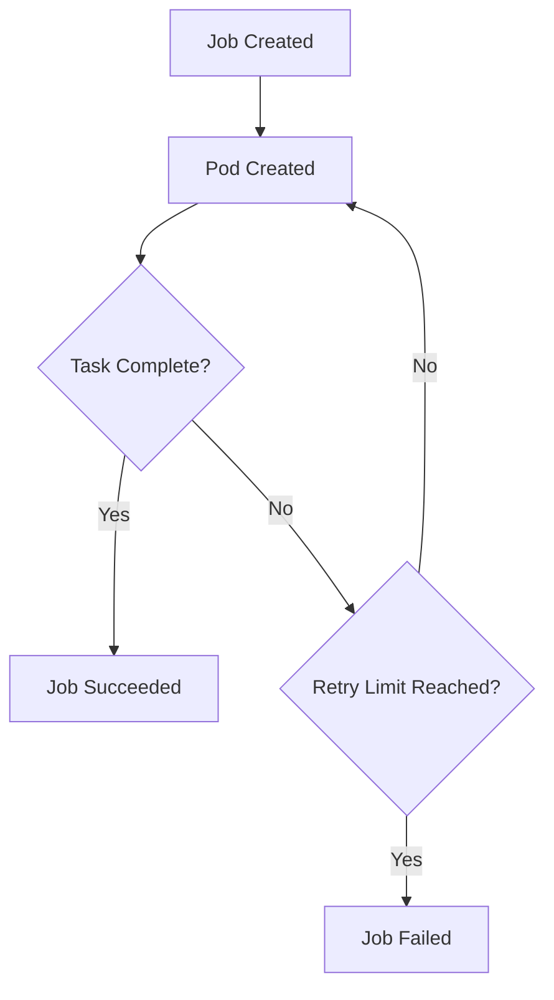
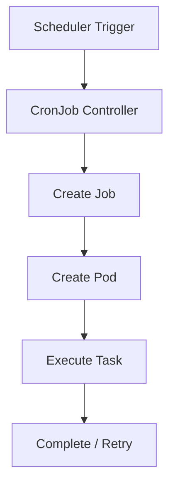

# Kubernetes Jobs & CronJobs

## 📘 Introduction

In Kubernetes, not all workloads are long-running services. Many tasks are **finite**, **batch-oriented**, or **scheduled**. This is where **Jobs** and **CronJobs** come into play.

* **Job**: Runs a task **once** (or until completion).
* **CronJob**: Runs a task **on a schedule**, similar to Linux `cron`.

They are part of the Kubernetes **batch/v1 API** and are essential for automation, data processing, and maintenance workflows.

---

## 🤔 Why Do We Need Jobs & CronJobs?

### Common Use Cases

* Database migrations
* Batch data processing
* Backup & restore operations
* Sending periodic reports
* Cleanup tasks (logs, temp files)
* Scheduled API calls

### Problem They Solve

| Problem                                       | Solution             |
| --------------------------------------------- | -------------------- |
| Need to run a task once and ensure completion | Job                  |
| Need retries on failure                       | Job (`backoffLimit`) |
| Need scheduled execution                      | CronJob              |
| Need parallel processing                      | Job (`parallelism`)  |

---

## 🧠 Conceptual Overview

### Job Lifecycle



---

### CronJob Workflow



---

## ⚙️ Kubernetes Job

### 🧾 Example Manifest

```yaml
apiVersion: batch/v1
kind: Job
metadata:
  name: pi
spec:
  template:
    spec:
      containers:
      - name: pi
        image: perl:5.34.0
        command: ["perl",  "-Mbignum=bpi", "-wle", "print bpi(2000)"]
      restartPolicy: Never
  backoffLimit: 4
```

### 🔍 Explanation

* **restartPolicy: Never** → Pod won’t restart automatically
* **backoffLimit: 4** → Retry up to 4 times on failure
* The job completes when the container exits successfully

---

### 🛠️ Designing Jobs for Specific Tasks

#### Key Fields

| Field                   | Purpose                            |
| ----------------------- | ---------------------------------- |
| `completions`           | Total successful runs required     |
| `parallelism`           | Number of pods running in parallel |
| `backoffLimit`          | Retry attempts                     |
| `activeDeadlineSeconds` | Max execution time                 |

---

### 📌 Example: Parallel Job

```yaml
spec:
  completions: 5
  parallelism: 2
```

➡️ Runs 5 tasks, 2 at a time.

---

## ⏰ Kubernetes CronJob

### 🧾 Example Manifest

```yaml
apiVersion: batch/v1
kind: CronJob
metadata:
  name: hello
spec:
  schedule: "* * * * *"
  jobTemplate:
    spec:
      template:
        spec:
          containers:
          - name: hello
            image: busybox:1.28
            imagePullPolicy: IfNotPresent
            command:
            - /bin/sh
            - -c
            - date; echo Hello from the Kubernetes cluster
          restartPolicy: OnFailure
```

---

### 🕒 Cron Schedule Format

```
* * * * *
| | | | |
| | | | └── Day of week (0-6)
| | | └──── Month (1-12)
| | └────── Day of month (1-31)
| └──────── Hour (0-23)
└────────── Minute (0-59)
```

---

### 🔧 Important Fields

| Field                        | Description              |
| ---------------------------- | ------------------------ |
| `schedule`                   | Cron expression          |
| `concurrencyPolicy`          | Allow / Forbid / Replace |
| `successfulJobsHistoryLimit` | Retain successful jobs   |
| `failedJobsHistoryLimit`     | Retain failed jobs       |

---

## 🏗️ Dev vs Prod Setup

### 🧪 Development Environment

* Use lightweight images (e.g., busybox)
* Lower retry limits
* Frequent schedules for testing

```yaml
backoffLimit: 1
schedule: "*/2 * * * *"
```

---

### 🚀 Production Environment

* Add observability (logs, metrics)
* Use resource limits
* Add failure handling
* Secure credentials (Secrets)

```yaml
resources:
  requests:
    cpu: "100m"
    memory: "128Mi"
  limits:
    cpu: "500m"
    memory: "512Mi"
```

---

## 🌍 Real-World Use Cases

### 1. Database Backup CronJob


---

### 2. Data Processing Job


---

### 3. Cleanup CronJob

* Deletes old logs
* Cleans temp files

---

## 🧩 Best Practices

* Use **idempotent jobs** (safe to retry)
* Set **resource limits**
* Configure **backoffLimit**
* Use **labels for tracking**
* Monitor via:

  * `kubectl get jobs`
  * `kubectl describe job`
  * `kubectl logs`

---

## 🔍 Useful Commands

```bash
kubectl create -f job.yaml
kubectl get jobs
kubectl describe job pi
kubectl logs <pod-name>
kubectl delete job pi
```

---

## ⚠️ Common Pitfalls

* Forgetting `restartPolicy`
* Infinite retries without limits
* Overlapping CronJobs (fix with `concurrencyPolicy`)
* Not cleaning old Jobs

---

## 🧭 Summary

| Feature   | Job        | CronJob        |
| --------- | ---------- | -------------- |
| Execution | One-time   | Scheduled      |
| Use Case  | Batch task | Recurring task |
| Retry     | Yes        | Yes            |
| Scheduler | Manual     | Cron           |

---

## 📚 Final Thoughts

Kubernetes Jobs and CronJobs are powerful tools for **automation and batch processing**. When designed correctly, they:

* Improve reliability
* Reduce manual work
* Enable scalable background processing

---
