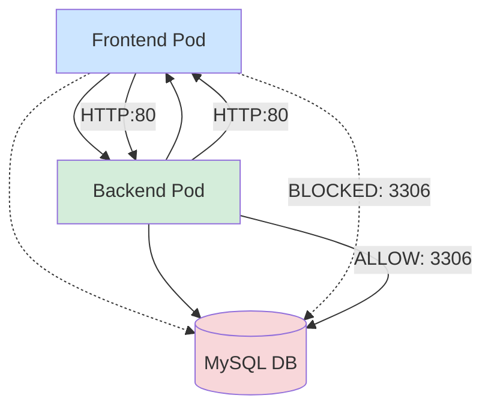
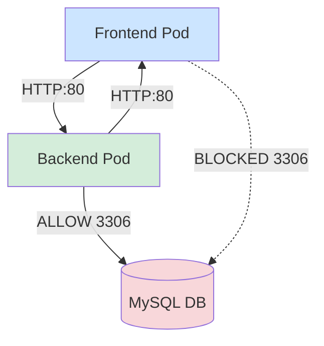

# 🧪 Kubernetes Network Policies Tutorial (Kind + Calico)

## 📌 Overview

This tutorial demonstrates how to:

* Create a **Kind Kubernetes cluster**
* Disable the default CNI
* Install **Calico CNI**
* Deploy a **multi-tier application (frontend, backend, db)**
* Verify **unrestricted pod communication (flat network)**
* Apply **NetworkPolicies to isolate traffic**
* Validate **restricted communication**

---

## 🏗️ Cluster Architecture (Before Network Policies)



👉 **Explanation:**

* All pods can communicate freely (flat network)
* No restrictions exist yet
* This is Kubernetes' default behavior **without NetworkPolicies**

---

## ⚙️ Step 1: Create Kind Cluster

### 📄 Kind Configuration

```yaml
# three node (two workers) cluster config
kind: Cluster
apiVersion: kind.x-k8s.io/v1alpha4
nodes:
- role: control-plane

  # -------------------------------------------------------
  # PORT FORWARD BLOCK (LOCALHOST ACCESS ONLY)
  # -------------------------------------------------------
  # port forward to 30090 on localhost
  # Only required if accessing via localhost (127.0.0.1)
  # Not required for node-ip based access
  extraPortMappings:
    - containerPort: 30090
      hostPort: 30090
      listenAddress: "127.0.0.1"
      protocol: TCP

- role: worker
- role: worker

networking:
  # Disable default CNI to install custom CNI (Calico)
  disableDefaultCNI: true

  # Custom pod & service CIDRs
  podSubnet: "192.178.0.0/16"
  serviceSubnet: "192.179.0.0/16"
```

### 🚀 Create Cluster

```bash
kind create cluster --name test-cluster --config kind-config.yaml
```

---

## 🌐 Step 2: Install Calico CNI

```bash
kubectl apply -f https://raw.githubusercontent.com/projectcalico/calico/v3.31.4/manifests/calico.yaml
```

### ❓ Why NOT Operator Installation?

We use **manifest-based installation** instead of operator because:

* ✅ Simpler and faster for local environments (Kind)
* ❌ Operator requires:

  * Additional CRDs
  * IPPool configuration
  * More components and lifecycle management
* ❌ Overkill for learning/demo setups

👉 For production → Operator is recommended
👉 For labs/tutorials → Manifest is ideal

---

## 🚀 Step 3: Deploy Application

### 📄 Application YAML

```yaml
apiVersion: v1
kind: Pod
metadata:
  name: frontend
  labels:
    role: frontend
spec:
  containers:
  - name: nginx
    image: nginx
    ports:
    - name: http
      containerPort: 80
---
apiVersion: v1
kind: Service
metadata:
  name: frontend
spec:
  selector:
    role: frontend
  ports:
  - port: 80
---
apiVersion: v1
kind: Pod
metadata:
  name: backend
  labels:
    role: backend
spec:
  containers:
  - name: nginx
    image: nginx
    ports:
    - name: http
      containerPort: 80
---
apiVersion: v1
kind: Service
metadata:
  name: backend
spec:
  selector:
    role: backend
  ports:
  - port: 80
---
apiVersion: v1
kind: Service
metadata:
  name: db
spec:
  selector:
    name: mysql
  ports:
  - port: 3306
---
apiVersion: v1
kind: Pod
metadata:
  name: mysql
  labels:
    name: mysql
spec:
  containers:
    - name: mysql
      image: mysql:latest
      env:
        - name: MYSQL_USER
          value: mysql
        - name: MYSQL_PASSWORD
          value: mysql
        - name: MYSQL_DATABASE
          value: testdb
        - name: MYSQL_ROOT_PASSWORD
          value: verysecure
      ports:
        - containerPort: 3306
```

---

## 🔍 Step 3.1: Verify Pods & Access Running Containers

Before testing connectivity, ensure all pods are running and accessible.

### 📌 Check Pods

```bash
kubectl get pods -o wide
```

### ✅ Sample Output

```bash
NAME       READY   STATUS    RESTARTS   AGE   IP              NODE
frontend   1/1     Running   0          2m    192.178.1.10    kind-worker
backend    1/1     Running   0          2m    192.178.2.15    kind-worker2
mysql      1/1     Running   0          2m    192.178.3.20    kind-worker
```

👉 **Observation:**

* All pods are in **Running** state
* Each pod has a unique IP from the pod subnet

---

### 🔐 Exec into Frontend Pod

```bash
kubectl exec -it frontend -- bash
```

### ✅ Sample Output

```bash
root@frontend:/#
```

---

### 🔐 Exec into Backend Pod

```bash
kubectl exec -it backend -- bash
```

### ✅ Sample Output

```bash
root@backend:/#
```

---

### 🔐 Exec into MySQL Pod

```bash
kubectl exec -it mysql -- bash
```

### ✅ Sample Output

```bash
root@mysql:/#
```

---

👉 **Why this step matters:**

* Confirms pods are reachable
* Ensures shell access for testing (curl, telnet)
* Helps debug early if something is broken before network policy testing

---

## 🧪 Step 4: Test Connectivity (Before Policies)

### 🔧 Install Tools

```bash
apt update && apt install telnet -y
```

### 🔍 Test Commands

```bash
curl db:3306
telnet backend 80
telnet db 3306
curl backend:80
curl frontend:80
```

### ✅ Sample Output

```bash
telnet backend 80
Trying 192.179.69.67...
Connected to backend.

telnet db 3306
Trying 192.179.148.76...
Connected to db.
9.6.0 caching_sha2_password
```

👉 **Observation:**

* All pods can reach each other
* No restrictions → **Flat network**

---

## 🔐 Step 5: Apply Network Policy

### 🎯 Goal

* Allow only:

  * `backend → db (port 3306)`
* Deny:

  * `frontend → db`

---

## 📄 Network Policy (with Comments)

```yaml
apiVersion: networking.k8s.io/v1
kind: NetworkPolicy
metadata:
  name: test-network-policy
  namespace: default

spec:
  # Select target pods (DB pods)
  podSelector:
    matchLabels:
      name: mysql

  # Apply only ingress rules
  policyTypes:
  - Ingress

  ingress:
  - from:
      # Allow traffic ONLY from backend pods
      - podSelector:
          matchLabels:
            role: backend

    ports:
      # Allow only MySQL port
      - protocol: TCP
        port: 3306
```

---

## 🔍 Describe Policy

```bash
kubectl describe netpol test-network-policy
```

### Output

```
PodSelector: name=mysql
Allowing ingress traffic:
  To Port: 3306/TCP
  From:
    PodSelector: role=backend
```

---

## 🏗️ Cluster Architecture (After Network Policies)



👉 **Explanation:**

* ❌ Frontend → DB = BLOCKED
* ✅ Backend → DB = ALLOWED
* Other traffic remains unaffected

---

## 🧪 Step 6: Test After Policy

### ❌ Frontend (Blocked)

```bash
kubectl exec -it frontend -- bash

telnet db 3306
Trying 192.179.148.76...
^C

curl db:3306
^C
```

👉 Connection fails → **Expected behavior**

---

### ✅ Backend (Allowed)

```bash
kubectl exec -it backend -- bash

curl db:3306
curl: (1) Received HTTP/0.9 when not allowed

telnet db 3306
Trying 192.179.148.76...
Connected to db.
9.6.0 caching_sha2_password
```

👉 Connection succeeds → **Policy working correctly**

---

## 🧠 Key Takeaways

* By default, Kubernetes allows **all pod-to-pod communication**
* NetworkPolicies are:

  * **Deny by default (once applied)**
  * **Allow only explicitly defined traffic**
* Policies are:

  * **Namespace scoped**
  * Applied via **labels**
* Requires a CNI that supports policies (e.g., **Calico**)

---

## 🧩 Additional Testing Ideas

* Use `nc` (netcat):

```bash
nc -zv db 3306
```

* Use busybox test pod:

```bash
kubectl run test --rm -it --image=busybox -- sh
```

* Test DNS:

```bash
nslookup db
```

---

## 🎯 Summary

You successfully:

* Built a Kind cluster with custom networking
* Installed Calico CNI
* Deployed a 3-tier application
* Verified flat networking
* Applied NetworkPolicy
* Enforced **zero-trust pod communication**

---

